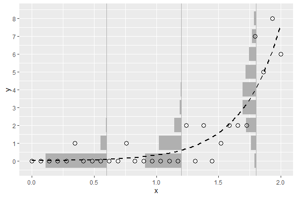

# 第二章

## ポアソン分布の最尤推定量

- ポアソン分布

- ポアソン分布の尤度関数L

- 対数尤度関数l

- 対数尤度関数をλで偏微分

- 偏微分下対数尤度関数を0とおいてλについて解く

- 以上より、λの最尤推定量はデータの平均値である

- なお、上記の数式はオンラインLaTex数式エディタ[CODECOGS](https://www.codecogs.com/latex/eqneditor.php)で作成した

## 統計検定対応

### ポアソン分布の平均の導出

- k-1 = k', n=∞と置くと、後ろの項がポアソン分布であり、確率分布関数の総和は1になることを利用している

### ポアソン分布の分散の導出

- 以上より、ポアソン分布の平均はλ、分散もλである

### 自分用メモ

- 最尤法によるパラメータの推定量の分散はVar(X)/n（推定量の漸近正規性）
- クラメールラオの不等式より、推定量の分散はフィッシャー情報量の逆数よりも小さくなることはできない
- つまり、推定量の分散がフィッシャー情報量の逆数と等しいとき、その推定量がもっとも良い推定量（=有効推定量）となる
- より詳しくは「統計的機械学習の数理100問 with Python」のp95~98(4.2項)を参照すること
- もしくは「自然科学の統計学」のp128~p132(4.4.1一致性、4.4.2漸近有効性)が、ポアソン分布を例に説明してあるのでわかりやすい
- 証明は込み入っているが、数値シミュレーションでもパラメータが正規分布すること、その分散がVar(X)/nになることは確かめられる

# 第三章

## 一般化線形モデルとリンク関数
- 3.4.1で割と唐突に「リンク関数」が出てくるので、一般化線形モデルの前提を少し加える

### 線形モデルってなんだったっけ？

- 線形モデルとは説明変数xに係数βをかけたものの和から被説明変数を算出するもの
- 説明変数の値ごとにyが正規分布していることを前提としている
- 正規分布している、ということは説明変数の平均と分散をそのまま正規分布の平均と分散の推定値とすることができる、ということ
	- 説明変数から算出した平均をそのまま正規分布のパラメータとして用いることができる、という意味
- では、被説明変数が正規分布以外（本書ではポアソン分布）の分布の場合はどうしたら良いのだろうか？

### 線形モデルを一般化線形モデルに拡張
- たとえば被説明変数がカウントデータの場合、正規分布を用いることができない
	- カウントデータは0～∞の離散値であり、-∞~∞の連続値を対象とした正規分布はそぐわないため
- なので、被説明変数のパラメータ（ポアソン分布の場合はλ）を説明変数から算出するには、説明変数から得られた推定値を被説明変数が従う分布のパラメータに変換してやる必要がある
- **その変換のための関数がリンク関数である**

## 図3.9を自力で描画してみた

# 第四章

## あらすじ
- 最大対数尤度でモデルの「当てはまりの良さ」を評価することができる
- しかし、それは「たまたま得られたデータに対する当てはまりの良さ」であり、新たにとられるであろうデータに対する当てはまりの良さではない
- そこで数値実験により平均対数尤度（最大対数尤度の期待値）を算出し、最大対数尤度との差の分布を検討した
- その結果、差の期待値（=バイアス）はおおよそパラメータ数と一致することが分かった
- AICが対数尤度にパラメータ数を足しているのは、そのバイアスを補正するためである

## 不偏分散の証明（統計検定対応）
- バイアスという言葉でふと思い出したので、本文には直接関係ないが、不偏分散の証明を復習した

### 不偏推定量とは
- あるパラメータがその推定量の期待値と一致するとき、を不偏推定量と呼ぶ
- [不偏推定量とは？平均と分散を例に分かりやすく解説](https://ai-trend.jp/basic-study/estimator/unbiasedness/)

### 推定量のバイアス
- 推定量のバイアスは以下の式で定式化される。
- バイアスが0のとき、は不偏推定量である
- バイアスが0でないとき、をバイアスで補正することにより不偏推定量を得ることができる
- [偏り(Wikipedia JP)](https://ja.wikipedia.org/wiki/%E5%81%8F%E3%82%8A)

### 平均の分散
- 確率変数を考える
- Xは平均、分散をもつ分布から得られたものとする
- このときのXの標本平均の分散は以下のように求められる

- 一般に以下の等式が成り立つ
- より詳細は[Variance(wikipedia in En)](https://en.wikipedia.org/wiki/Variance)を参照

### 標本分散の算出

### 標本分散の式変形

### 標本分散の期待値

### バイアス補正

