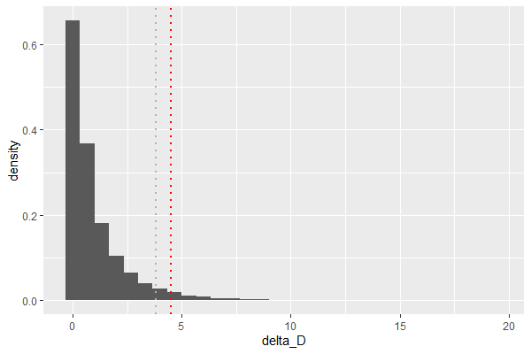

# 第二章

## ポアソン分布の最尤推定量

- ポアソン分布

- ポアソン分布の尤度関数L

- 対数尤度関数l

- 対数尤度関数をλで偏微分

- 偏微分下対数尤度関数を0とおいてλについて解く

- 以上より、λの最尤推定量はデータの平均値である

- なお、上記の数式はオンラインLaTex数式エディタ[CODECOGS](https://www.codecogs.com/latex/eqneditor.php)で作成した

## 統計検定対応

### ポアソン分布の平均の導出

- k-1 = k', n=∞と置くと、後ろの項がポアソン分布であり、確率分布関数の総和は1になることを利用している

### ポアソン分布の分散の導出

- 以上より、ポアソン分布の平均はλ、分散もλである

### 自分用メモ

- 最尤法によるパラメータの推定量の分散はVar(X)/n（推定量の漸近正規性）
- クラメールラオの不等式より、推定量の分散はフィッシャー情報量の逆数よりも小さくなることはできない
- つまり、推定量の分散がフィッシャー情報量の逆数と等しいとき、その推定量がもっとも良い推定量（=有効推定量）となる
- より詳しくは「統計的機械学習の数理100問 with Python」のp95~98(4.2項)を参照すること
- もしくは「自然科学の統計学」のp128~p132(4.4.1一致性、4.4.2漸近有効性)が、ポアソン分布を例に説明してあるのでわかりやすい
- 証明は込み入っているが、数値シミュレーションでもパラメータが正規分布すること、その分散がVar(X)/nになることは確かめられる

# 第三章

## 一般化線形モデルとリンク関数
- 3.4.1で割と唐突に「リンク関数」が出てくるので、一般化線形モデルの前提を少し加える

### 線形モデルってなんだったっけ？

- 線形モデルとは説明変数xに係数βをかけたものの和から被説明変数を算出するもの
- 説明変数の値ごとにyが正規分布していることを前提としている
- 正規分布している、ということは説明変数の平均と分散をそのまま正規分布の平均と分散の推定値とすることができる、ということ
	- 説明変数から算出した平均をそのまま正規分布のパラメータとして用いることができる、という意味
- では、被説明変数が正規分布以外（本書ではポアソン分布）の分布の場合はどうしたら良いのだろうか？

### 線形モデルを一般化線形モデルに拡張
- たとえば被説明変数がカウントデータの場合、正規分布を用いることができない
	- カウントデータは0～∞の離散値であり、-∞~∞の連続値を対象とした正規分布はそぐわないため
- なので、被説明変数のパラメータ（ポアソン分布の場合はλ）を説明変数から算出するには、説明変数から得られた推定値を被説明変数が従う分布のパラメータに変換してやる必要がある
- **その変換のための関数がリンク関数である**

## 図3.9を自力で描画してみた

# 第四章

## あらすじ
- 最大対数尤度でモデルの「当てはまりの良さ」を評価することができる
- しかし、それは「たまたま得られたデータに対する当てはまりの良さ」であり、新たにとられるであろうデータに対する当てはまりの良さではない
- そこで数値実験により平均対数尤度（最大対数尤度の期待値）を算出し、最大対数尤度との差の分布を検討した
- その結果、差の期待値（=バイアス）はおおよそパラメータ数と一致することが分かった
- AICが対数尤度にパラメータ数を足しているのは、そのバイアスを補正するためである

## 不偏分散の証明（統計検定対応）
- バイアスという言葉でふと思い出したので、本文には直接関係ないが、不偏分散の証明を復習した

### 不偏推定量とは
- あるパラメータがその推定量の期待値と一致するとき、を不偏推定量と呼ぶ
- [不偏推定量とは？平均と分散を例に分かりやすく解説](https://ai-trend.jp/basic-study/estimator/unbiasedness/)

### 推定量のバイアス
- 推定量のバイアスは以下の式で定式化される。
- バイアスが0のとき、は不偏推定量である
- バイアスが0でないとき、をバイアスで補正することにより不偏推定量を得ることができる
- [偏り(Wikipedia JP)](https://ja.wikipedia.org/wiki/%E5%81%8F%E3%82%8A)

### 平均の分散
- 確率変数を考える
- Xは平均、分散をもつ分布から得られたものとする
- このときのXの標本平均の分散は以下のように求められる

- 一般に以下の等式が成り立つ
- より詳細は[Variance(wikipedia in En)](https://en.wikipedia.org/wiki/Variance)を参照

### 標本分散の算出

### 標本分散の式変形

### 標本分散の期待値

### バイアス補正

# 第五章

## パラメトリックブートストラップ法の結果
- Null modelの条件下で生成されたデータを用いて、Null modelとx modelのdevianceの差の分布を計算
- その分布における片側95%点は3.82（グレーの縦線）、実際のデータから得られたdevianceの差は4.51（赤の縦線）
- 以上より、Null modelから生成されたデータでは偶然にx modelの方が4.5程度小さい逸脱度になる確率が小さいため、Null modelは棄却され、x modelが採択される

## ＜参考＞ネイマン=ピアソンとフィッシャーの論争
- まず前提として、ネイマン=ピアソンもフィッシャーも、頻度論の立場をとる。頻度論とは「確率とはある事象が発生する頻度のことである」とする立場である。
	- 頻度論的確率に対し、ベイズ確率は「ある事象が発生することに対する信念の度合」とする。ベイズ確率において「確率分布のパラメータそのものが分布する」と考えるのはその所以である。頻度論においては「確率分布のパラメータは唯一真の値がある」と考える。
	- [ベイズ確率](https://ja.wikipedia.org/wiki/%E3%83%99%E3%82%A4%E3%82%BA%E7%A2%BA%E7%8E%87)
	- [頻度主義統計、ベイズ統計、統計モデリングからみた「真値」](https://norimune.net/3186)
- ネイマン=ピアソンとフィッシャーの論争の論点は「P値の扱い」にある
	- 以下[読書日記](https://elsur.jpn.org/mt/2016/04/002332.html)から引用
	> フィッシャー派の立場では、P値は個別的な研究上の知見について、帰無仮説に反対する証拠として解釈される。有意水準を事前に固定する必要はない。対立仮説もない。仮説を受容するか棄却するかという判断ではなく、仮説に関する推論を行うのが良しとされる
	> ネイマン=ピアソン派の立場では、目的は推論じゃなくて決定である。事前に有意水準を決めておき、P値がそれを下回ったら「統計的に有意」という決定を行い、対立仮説を支持する。この過程で生じうるエラーは2種類あることになる(Type IとType II)。ここから検定力という概念が生まれた。また、この考え方は臨床試験における標本サイズ決定の基盤となった。
	- 現在主流の仮説検定理論はネイマン=ピアソン流の考え方であり、意思決定の手段として用いられる。そのため、極めて周到な事前準備が行われ、最終的に得られたP値をもって意思決定が行われる。新薬承認における仮説検定が非常に入念な準備のもとに行われるのは、ネイマン=ピアソン流の考え方にしたがっているが故である。
	- 一方、フィッシャー流の考え方はほとんど用いられない。
	- しかしながら、ネイマン=ピアソン流の仮説検定理論はしばしば誤用され、またp-value hacking等に悪用され、問題となっている。仮説検定によって得られる結論は例えば「群Aと群Bに差がある」といったものであり、その差がどれくらいかは問わない。どんなに差が小さくても、サンプルサイズを大きくすれば統計的に有意な差を得ることができてしまう。
	- そこで[効果量](https://qiita.com/fhiyo/items/9cb2b05b36566ffe0eff)といった指標も出てきているが、p値に変わる指標が出てきていないのが現状。

# 第六章

## オフセット項について
- いまいちオフセット項の使いどころがわからない
	- [GLMの基礎：オフセット項（割算値の回避）](https://rindalog.blogspot.com/2016/01/glm_23.html)
- 本文では変数変換も好ましくないとしているが、kaggle等では測定値の対数変換などがよく使われている（ガンマ回帰のところでもすこし言及）
	- これは機械学習の文脈と統計的モデリングの文脈で異なるものだと考えて良いか？それとも一般的に好ましくないものなのか？
	- たとえばkaggleの住宅価格問題など
	- 実業務においても、どちらかというと0より大で連続値の対数正規分布っぽいデータを見ることが多いので、ガンマ分布のGLMなどをもう少し掘り下げた方が良いかもしれない

## ロジスティック回帰
- 要するに応答変数が二項分布することを仮定した回帰である
- 推定されるのは二項分布におけるパラメータq(成功確率)であり、基本的に0-1の間にある

### 参考:指数分布族
- 一般化線形モデルが仮定する確率分布は指数分布族に属するものである
- [【回帰分析の数理】#6 一般化線形モデル（GLM）とは](https://seedata.co.jp/blog/tech/3806/)
- 指数分布族とは、以下で定式化できる分布全般のこと。この形に変形するには、まず全体をexpに入れて、各パラメータをa,b,cそれぞれに組み込んでいけば良い。
- 計算の練習になるので自分でやってみるのも良い

## ガンマ回帰
- 本項では説明変数の対数がとられている。これは変数変換とは違うのか？
	- 改めて読んでみると、そもそもの仮定がμ=Ax^bであり、線形性を仮定していない
	- これを線形予測子の形に変換するためにA=exp(a)として両辺対数をとり、log(μ)=a+blogxの形に変形している
	- つまり、「もとの変数が対数をとると正規分布になるから」という理由で対数変換をしているわけではなく、そもそものモデル式が線形性を仮定していないため、回帰のためにモデル式全体を変換している、ということなのだと理解した
		- そう考えると、もしかしてある変数xを対数変換してy=β_0+log(x)β_1という式をたてるのはそもそもよろしくない、ということか？
- 変数変換の意味について
	- [対数変換を行う意味について。回帰分析において対数変換する背景にある前提とは？](https://atarimae.biz/archives/13161)
	- [どのようなときに目的変数Yではなくlog(Y)にしたほうがよいのか？～対数変換するメリットとデメリット～](https://datachemeng.com/post-3529/)
	- [回帰分析において自然対数をとる目的](https://h-memo.com/the-purpose-of-taking-the-natural-logarithm-in-regression-analysis/)

## モデル選択
- いわずとしれたTJOさんのブログから
	- [「使い分け」ではなく「妥当かどうか」が大事：重回帰分析＆一般化線形モデル選択まわりの再まとめ](https://tjo.hatenablog.com/entry/2013/09/23/232814)

## 【統計検定対応】正規分布の最尤推定量の導出
- p137で正規分布の尤度関数が出てきたので、復習ついでにパラメータの最尤推定量導出を復習

- 正規分布

- 正規分布の尤度関数

- 対数尤度関数

- μで偏微分して最尤推定量を求める

- σ^2で偏微分して最尤推定量を求める

- 分散の最尤推定量と標本分散（=不偏分散）は実は異なっている

# 第七章

- テクニカルな説明はほとんどRのコード内にコメントで記載した

## 一般化線形混合モデルの考え方
- 本文の例である二項分布の場合は以下で定式化する
	- 以下の式でx_iにおける二項分布のパラメータqを推定している。このときのリンク関数はlogit関数である

- これまでなかったr_iの項が追加されている
- r_iは過分散を表現するためのパラメータであり、平均0、標準偏差sの正規分布に従うと仮定する

- つまり、r_iの確率分布は以下で示すことができる

- しかし、r_iはそれ自体では最尤推定できないので、以下のような尤度関数を構成する
	- これをどう解いたら良いのかはわからない
	- 解を求めるのはRがやってくれるので、このあたりの導出とかは今度探してみよう

- 素朴に考えるとr_i=0の時にp(r_i|s)が最も大きくなるのでr_i=0として推定されやすくなるのでは？と思ったけれども、それも込みでqを推定するので必ずしもそうでないことに思い至った

## 反復・疑似反復 p161
- 「反復」「疑似反復」という用語の使い方がちょっと一般的でないので、(A)~(D)の例を自分なりに書き換えてみる
	- A
		- 各鉢に1個体ずつしかおらず、1個体から種子を一つしかとらないため、測定できるのは「全体としての種子の生存率」のみである
		- したがって、個体差も鉢差も入れることができない
	- B
		- 各個体から複数の種子をとるため、「各個体の種子の生存率」が観測できる。しかし、鉢には1個体しかいないため、鉢全体としての種子の生存率はわからない
		- したがって、個体差は入れられるが、鉢差は入れることができない
	- C
		- 各個体から1つずつしか種子をとらないため、各個体の種子の生存率はわからない。一方で鉢の中には複数の個体がいるため、「鉢全体としての種子の生存率」は観測できる
		- したがって、個体差は入れられないが、鉢差は入れることができる
	- D
		- 個体から複数の種子をとり、鉢にも複数の個体がいるため、各個体および鉢全体の種子の生存率を観測できる
		- したがって、個体差も鉢差も入れることができる
- つまり、
	- 反復：独立した対象から複数回データを観測する、ただしひとつの対象あたり1回の観測とする
	- 疑似反復：独立していない対象からデータを複数回観測する

### 余談
- これは細胞を用いた実験やPCRにおけるtechnical replicateとbiological replicateの話に通じるように思う
	- [What is the difference between a biological replicate and a technical replicate?](https://www.quora.com/What-is-the-difference-between-a-biological-replicate-and-a-technical-replicate)
	- PCRの場合、一つのサンプルを増幅させて検出する。そのため、一つのサンプルが大量に「反復」されることになるが、それは元がひとつのサンプルなのでtechnical replicate(本文でいう疑似反復)
	- 一方でPCRで複数のサンプル（違うヒトからとったもの）であれば、サンプルのソースがまったくことなるので、biological replicate(本文でいう反復)
	- ただし、このとき同じヒトから複数のサンプルをとった場合はtechnical replicateである、なぜならそれらのサンプルは生物学的に異なるものだとは言えないからである