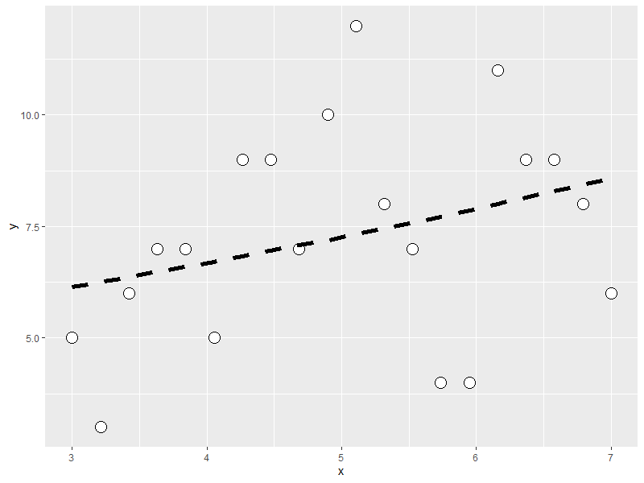
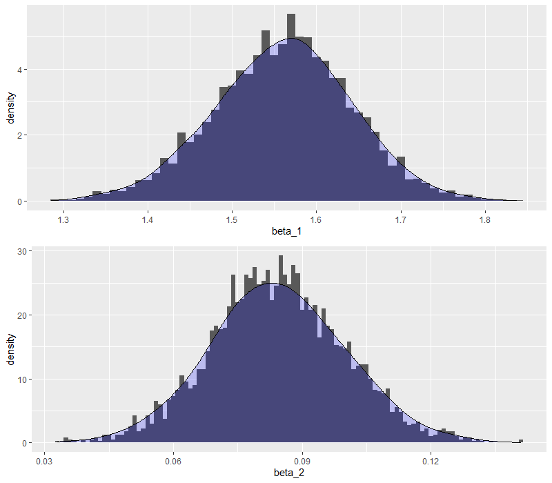

# 第二章

## ポアソン分布の最尤推定量

- ポアソン分布


- ポアソン分布の尤度関数L


- 対数尤度関数l


- 対数尤度関数をλで偏微分


- 偏微分下対数尤度関数を0とおいてλについて解く


- 以上より、λの最尤推定量はデータの平均値である

- なお、上記の数式はオンラインLaTex数式エディタ[CODECOGS](https://www.codecogs.com/latex/eqneditor.php)で作成した

## 統計検定対応

### ポアソン分布の平均の導出


- k-1 = k', n=∞と置くと、後ろの項がポアソン分布であり、確率分布関数の総和は1になることを利用している

### ポアソン分布の分散の導出


- 以上より、ポアソン分布の平均はλ、分散もλである

### 自分用メモ

- 最尤法によるパラメータの推定量の分散はVar(X)/n（推定量の漸近正規性）
- クラメールラオの不等式より、推定量の分散はフィッシャー情報量の逆数よりも小さくなることはできない
- つまり、推定量の分散がフィッシャー情報量の逆数と等しいとき、その推定量がもっとも良い推定量（=有効推定量）となる
- より詳しくは「統計的機械学習の数理100問 with Python」のp95~98(4.2項)を参照すること
- もしくは「自然科学の統計学」のp128~p132(4.4.1一致性、4.4.2漸近有効性)が、ポアソン分布を例に説明してあるのでわかりやすい
- 証明は込み入っているが、数値シミュレーションでもパラメータが正規分布すること、その分散がVar(X)/nになることは確かめられる


# 第三章

## 一般化線形モデルとリンク関数
- 3.4.1で割と唐突に「リンク関数」が出てくるので、一般化線形モデルの前提を少し加える

### 線形モデルってなんだったっけ？


- 線形モデルとは説明変数xに係数βをかけたものの和から被説明変数を算出するもの
- 説明変数の値ごとにyが正規分布していることを前提としている
- 正規分布している、ということは説明変数の平均と分散をそのまま正規分布の平均と分散の推定値とすることができる、ということ
	- 説明変数から算出した平均をそのまま正規分布のパラメータとして用いることができる、という意味
- では、被説明変数が正規分布以外（本書ではポアソン分布）の分布の場合はどうしたら良いのだろうか？

### 線形モデルを一般化線形モデルに拡張
- たとえば被説明変数がカウントデータの場合、正規分布を用いることができない
	- カウントデータは0～∞の離散値であり、-∞~∞の連続値を対象とした正規分布はそぐわないため
- なので、被説明変数のパラメータ（ポアソン分布の場合はλ）を説明変数から算出するには、説明変数から得られた推定値を被説明変数が従う分布のパラメータに変換してやる必要がある
- **その変換のための関数がリンク関数である**

## 図3.9を自力で描画してみた


# 第四章

## あらすじ
- 最大対数尤度でモデルの「当てはまりの良さ」を評価することができる
- しかし、それは「たまたま得られたデータに対する当てはまりの良さ」であり、新たにとられるであろうデータに対する当てはまりの良さではない
- そこで数値実験により平均対数尤度（最大対数尤度の期待値）を算出し、最大対数尤度との差の分布を検討した
- その結果、差の期待値（=バイアス）はおおよそパラメータ数と一致することが分かった
- AICが対数尤度にパラメータ数を足しているのは、そのバイアスを補正するためである

## 不偏分散の証明（統計検定対応）
- バイアスという言葉でふと思い出したので、本文には直接関係ないが、不偏分散の証明を復習した

### 不偏推定量とは
- あるパラメータがその推定量の期待値と一致するとき、を不偏推定量と呼ぶ
- [不偏推定量とは？平均と分散を例に分かりやすく解説](https://ai-trend.jp/basic-study/estimator/unbiasedness/)


### 推定量のバイアス
- 推定量のバイアスは以下の式で定式化される。
- バイアスが0のとき、は不偏推定量である
- バイアスが0でないとき、をバイアスで補正することにより不偏推定量を得ることができる
- [偏り(Wikipedia JP)](https://ja.wikipedia.org/wiki/%E5%81%8F%E3%82%8A)


### 平均の分散
- 確率変数を考える
- Xは平均、分散をもつ分布から得られたものとする
- このときのXの標本平均の分散は以下のように求められる


- 一般に以下の等式が成り立つ
- より詳細は[Variance(wikipedia in En)](https://en.wikipedia.org/wiki/Variance)を参照


### 標本分散の算出


### 標本分散の式変形


### 標本分散の期待値


### バイアス補正


# 第五章

## パラメトリックブートストラップ法の結果
- Null modelの条件下で生成されたデータを用いて、Null modelとx modelのdevianceの差の分布を計算
- その分布における片側95%点は3.82（グレーの縦線）、実際のデータから得られたdevianceの差は4.51（赤の縦線）
- 以上より、Null modelから生成されたデータでは偶然にx modelの方が4.5程度小さい逸脱度になる確率が小さいため、Null modelは棄却され、x modelが採択される


## ＜参考＞ネイマン=ピアソンとフィッシャーの論争
- まず前提として、ネイマン=ピアソンもフィッシャーも、頻度論の立場をとる。頻度論とは「確率とはある事象が発生する頻度のことである」とする立場である。
	- 頻度論的確率に対し、ベイズ確率は「ある事象が発生することに対する信念の度合」とする。ベイズ確率において「確率分布のパラメータそのものが分布する」と考えるのはその所以である。頻度論においては「確率分布のパラメータは唯一真の値がある」と考える。
	- [ベイズ確率](https://ja.wikipedia.org/wiki/%E3%83%99%E3%82%A4%E3%82%BA%E7%A2%BA%E7%8E%87)
	- [頻度主義統計、ベイズ統計、統計モデリングからみた「真値」](https://norimune.net/3186)
- ネイマン=ピアソンとフィッシャーの論争の論点は「P値の扱い」にある
	- 以下[読書日記](https://elsur.jpn.org/mt/2016/04/002332.html)から引用
	> フィッシャー派の立場では、P値は個別的な研究上の知見について、帰無仮説に反対する証拠として解釈される。有意水準を事前に固定する必要はない。対立仮説もない。仮説を受容するか棄却するかという判断ではなく、仮説に関する推論を行うのが良しとされる
	> ネイマン=ピアソン派の立場では、目的は推論じゃなくて決定である。事前に有意水準を決めておき、P値がそれを下回ったら「統計的に有意」という決定を行い、対立仮説を支持する。この過程で生じうるエラーは2種類あることになる(Type IとType II)。ここから検定力という概念が生まれた。また、この考え方は臨床試験における標本サイズ決定の基盤となった。
	- 現在主流の仮説検定理論はネイマン=ピアソン流の考え方であり、意思決定の手段として用いられる。そのため、極めて周到な事前準備が行われ、最終的に得られたP値をもって意思決定が行われる。新薬承認における仮説検定が非常に入念な準備のもとに行われるのは、ネイマン=ピアソン流の考え方にしたがっているが故である。
	- 一方、フィッシャー流の考え方はほとんど用いられない。
	- しかしながら、ネイマン=ピアソン流の仮説検定理論はしばしば誤用され、またp-value hacking等に悪用され、問題となっている。仮説検定によって得られる結論は例えば「群Aと群Bに差がある」といったものであり、その差がどれくらいかは問わない。どんなに差が小さくても、サンプルサイズを大きくすれば統計的に有意な差を得ることができてしまう。
	- そこで[効果量](https://qiita.com/fhiyo/items/9cb2b05b36566ffe0eff)といった指標も出てきているが、p値に変わる指標が出てきていないのが現状。


# 第六章

## オフセット項について
- いまいちオフセット項の使いどころがわからない
	- [GLMの基礎：オフセット項（割算値の回避）](https://rindalog.blogspot.com/2016/01/glm_23.html)
- 本文では変数変換も好ましくないとしているが、kaggle等では測定値の対数変換などがよく使われている（ガンマ回帰のところでもすこし言及）
	- これは機械学習の文脈と統計的モデリングの文脈で異なるものだと考えて良いか？それとも一般的に好ましくないものなのか？
	- たとえばkaggleの住宅価格問題など
	- 実業務においても、どちらかというと0より大で連続値の対数正規分布っぽいデータを見ることが多いので、ガンマ分布のGLMなどをもう少し掘り下げた方が良いかもしれない

## ロジスティック回帰
- 要するに応答変数が二項分布することを仮定した回帰である
- 推定されるのは二項分布におけるパラメータq(成功確率)であり、基本的に0-1の間にある

### 参考:指数分布族
- 一般化線形モデルが仮定する確率分布は指数分布族に属するものである
- [【回帰分析の数理】#6 一般化線形モデル（GLM）とは](https://seedata.co.jp/blog/tech/3806/)
- 指数分布族とは、以下で定式化できる分布全般のこと。この形に変形するには、まず全体をexpに入れて、各パラメータをa,b,cそれぞれに組み込んでいけば良い。
- 計算の練習になるので自分でやってみるのも良い


## ガンマ回帰
- 本項では説明変数の対数がとられている。これは変数変換とは違うのか？
	- 改めて読んでみると、そもそもの仮定がμ=Ax^bであり、線形性を仮定していない
	- これを線形予測子の形に変換するためにA=exp(a)として両辺対数をとり、log(μ)=a+blogxの形に変形している
	- つまり、「もとの変数が対数をとると正規分布になるから」という理由で対数変換をしているわけではなく、そもそものモデル式が線形性を仮定していないため、回帰のためにモデル式全体を変換している、ということなのだと理解した
		- そう考えると、もしかしてある変数xを対数変換してy=β_0+log(x)β_1という式をたてるのはそもそもよろしくない、ということか？
- 変数変換の意味について
	- [対数変換を行う意味について。回帰分析において対数変換する背景にある前提とは？](https://atarimae.biz/archives/13161)
	- [どのようなときに目的変数Yではなくlog(Y)にしたほうがよいのか？～対数変換するメリットとデメリット～](https://datachemeng.com/post-3529/)
	- [回帰分析において自然対数をとる目的](https://h-memo.com/the-purpose-of-taking-the-natural-logarithm-in-regression-analysis/)

## モデル選択
- いわずとしれたTJOさんのブログから
	- [「使い分け」ではなく「妥当かどうか」が大事：重回帰分析＆一般化線形モデル選択まわりの再まとめ](https://tjo.hatenablog.com/entry/2013/09/23/232814)

## 【統計検定対応】正規分布の最尤推定量の導出
- p137で正規分布の尤度関数が出てきたので、復習ついでにパラメータの最尤推定量導出を復習

- 正規分布


- 正規分布の尤度関数


- 対数尤度関数


- μで偏微分して最尤推定量を求める


- σ^2で偏微分して最尤推定量を求める


- 分散の最尤推定量と標本分散（=不偏分散）は実は異なっている


# 第七章

- テクニカルな説明はほとんどRのコード内にコメントで記載した

## 一般化線形混合モデルの考え方
- 本文の例である二項分布の場合は以下で定式化する
	- 以下の式でx_iにおける二項分布のパラメータqを推定している。このときのリンク関数はlogit関数である


- これまでなかったr_iの項が追加されている
- r_iは過分散を表現するためのパラメータであり、平均0、標準偏差sの正規分布に従うと仮定する


- つまり、r_iの確率分布は以下で示すことができる


- しかし、r_iはそれ自体では最尤推定できないので、以下のような尤度関数を構成する
	- これをどう解いたら良いのかはわからない
	- 解を求めるのはRがやってくれるので、このあたりの導出とかは今度探してみよう


- 素朴に考えるとr_i=0の時にp(r_i|s)が最も大きくなるのでr_i=0として推定されやすくなるのでは？と思ったけれども、それも込みでqを推定するので必ずしもそうでないことに思い至った

## 反復・疑似反復 p161
- 「反復」「疑似反復」という用語の使い方がちょっと一般的でないので、(A)~(D)の例を自分なりに書き換えてみる
	- A
		- 各鉢に1個体ずつしかおらず、1個体から種子を一つしかとらないため、測定できるのは「全体としての種子の生存率」のみである
		- したがって、個体差も鉢差も入れることができない
	- B
		- 各個体から複数の種子をとるため、「各個体の種子の生存率」が観測できる。しかし、鉢には1個体しかいないため、鉢全体としての種子の生存率はわからない
		- したがって、個体差は入れられるが、鉢差は入れることができない
	- C
		- 各個体から1つずつしか種子をとらないため、各個体の種子の生存率はわからない。一方で鉢の中には複数の個体がいるため、「鉢全体としての種子の生存率」は観測できる
		- したがって、個体差は入れられないが、鉢差は入れることができる
	- D
		- 個体から複数の種子をとり、鉢にも複数の個体がいるため、各個体および鉢全体の種子の生存率を観測できる
		- したがって、個体差も鉢差も入れることができる
- つまり、
	- 反復：独立した対象から複数回データを観測する、ただしひとつの対象あたり1回の観測とする
	- 疑似反復：独立していない対象からデータを複数回観測する

### 余談
- これは細胞を用いた実験やPCRにおけるtechnical replicateとbiological replicateの話に通じるように思う
	- [What is the difference between a biological replicate and a technical replicate?](https://www.quora.com/What-is-the-difference-between-a-biological-replicate-and-a-technical-replicate)
	- PCRの場合、一つのサンプルを増幅させて検出する。そのため、一つのサンプルが大量に「反復」されることになるが、それは元がひとつのサンプルなのでtechnical replicate(本文でいう疑似反復)
	- 一方でPCRで複数のサンプル（違うヒトからとったもの）であれば、サンプルのソースがまったくことなるので、biological replicate(本文でいう反復)
	- ただし、このとき同じヒトから複数のサンプルをとった場合はtechnical replicateである、なぜならそれらのサンプルは生物学的に異なるものだとは言えないからである


# 第八章

## 統計検定対応：MCMC、メトロポリス法、ギブスサンプリング
- 本書8章、9章に出てくるメトロポリス法、ギブスサンプリングはおそらく統計検定準一級の範囲内と思われる
	- 範囲表にばっちり入ってました
- 統計学実践ワークブックのp301から記載がある
- 統計学実践ワークブックの31章全体がベイズ推定の話なので、統計検定でもベイズは必須
- なので、ちょっと大変かもしれませんが本書の第八章、第九章を理解しておくと統計検定対策にもなるかもです

## WinBUGSとその周辺-確率的プログラミング
- この章からRだけでなくWinBUGSを使ったMCMCを実行するようになる
	- WinBUGSのBUGSとは'Bayesian inference Using Gibbs Sampling'
		- ギブスサンプリング(Gibbs sampling)については後述する
	- 下でも述べるように、WinBUGSには類似のソフトが複数ある。それらはBUGSの仲間である
- 本文にも書かれているように、WinBUGSは非常に古いソフトウェアで、すでにメンテナンスが終了している
	- その分、技術情報は充実している
- WinBUGS以外にも同様のことができる「確率的プログラミング言語」が複数あるのでメモ
	- 比較的よく目にするのは以下の3つくらい？RやってるとStanを一番よく見かけるかも
	1. [WingBUGS](https://www.mrc-bsu.cam.ac.uk/software/bugs/the-bugs-project-winbugs/)
		- 本書で使われているが、その派生で以下のようなものもある
			- [OpenBUGS](http://www.openbugs.net/)
			- [JAGS](http://mcmc-jags.sourceforge.net/)
		- WinBUGSでamazonで検索かけると洋書がたくさんでてくる
	1. [Stan](https://mc-stan.org/)
		- C++で書かれており非常に高速であるとの評判
		- RでMCMCやるような書籍にはよく出てくる
			ちなみにStanはHMC(ハミルトニアンモンテカルロ法)も実装されている
		- もちろんPython用のパッケージもある
		- Stanを使ったベイズ統計は以下の書籍が詳しい
			- [基礎からのベイズ統計学: ハミルトニアンモンテカルロ法による実践的入門](https://www.amazon.co.jp/dp/4254122128/)
				- 巻末にStanの書き方が記載されている
				- 内容は平易ですが、唐突に力学の話が入ってくるので注意（ハミルトニアンは解析力学で使う概念です）
			- [時系列分析と状態空間モデルの基礎: RとStanで学ぶ理論と実装](https://www.amazon.co.jp/dp/4903814874/)
	1. [Gen](https://www.gen.dev/)
		- 割と新しい、Juliaベースの確率的プログラミング言語
		- PyTorch, TensorFlowでも扱えるようになっているっぽい(ちゃんと見てない)
		- MITが開発したが、使われているのをあまり見たことがない
		- 2021/03/08時点でver0.4.2、19日前に更新されており、開発自体は途中ながらも進んでいるっぽい

### 確率的プログラミング
- 確率的プログラミングについて正確に述べるのは難しいので、以下のリンク先を参照
	- [確率的プログラミング](https://postd.cc/probabilistic-programming/)

### ギブスサンプリング
- WinBUGSがやっている'ギブスサンプリング'とは
	- 本文では9章のp214に出てくる
	- 素性がよくわからなかったり、複雑な入れ子構造になっていて直接サンプリングが難しい確率分布からのサンプリングを近似的に行う手法
	- [サンプリングによる近似ベイズ推論 その3（MCMC:ギブスサンプリング）](https://learning-with-machine.hatenablog.com/entry/2019/12/05/193000)
	- ちなみにここでいうギブスとは物理学者、数学者である[Josiah Willard Gibbs](https://en.wikipedia.org/wiki/Josiah_Willard_Gibbs)のこと
		- ギブスの熱力学、統計力学における数学的な概念を計算統計学に持ち込んだのがギブスサンプリングである
- なお、8章で紹介されているメトロポリス法はギブスサンプリングとは異なるサンプリング方法であることに留意

### 参考リンク先
- [確率的プログラミング言語を使ってみる（Pyro）](https://qiita.com/takeajioka/items/ab299d75efa184eb1432)
- [9. ベイズ推定に使うBUGSの話題](https://www.dynacom.co.jp/tech/tech_column/tech009.html)
- [Probabilistic programming @Wiki en](https://en.wikipedia.org/wiki/Probabilistic_programming)

## なぜMCMCを行うのか？
- メトロポリス法では確率によって尤度が低くなる方向にも動くのであった
- 直接、尤度が最も高いパラメータを選びに行くのが一番効率が良いのではないか？なぜわざわざ尤度が低くなるパラメータも選ばれるようにしているのか？
- それは、「パラメータの確率分布を求めたいから」である。観測されたデータから推定されるパラメータは最尤法では一つの値の定まるが、それも誤差を含んだものである。
- 解析的にパラメータが求められる分布であれば最尤法で構わないが、階層構造など、複雑な構造をしている統計モデルでは解析的に解を求めることができない
- そこで、モンテカルロ法を用いて様々なパラメータを発生させ、その確率分布を求めているのである。パラメータの確率分布を求めるので、**ベイズ的**なのである
	- MCMCサンプリングが「定常状態」になったときの分布がパラメータの確率分布となる
	- 定常状態になる前のサンプリング期間は採用しない
	- 「定常分布」ってなに？（ここに突っ込みだすとマルコフ過程の沼にはまります。入り口はマセマ本の巻末「マルコフ過程入門」をどうぞ。確率過程の話につながっていくのでさらに沼です）
		- [マルコフ連鎖の定常分布と極限分布](https://mathwords.net/teijobunpu)

### パラメータが確率分布するとはどういうことか：頻度主義とベイズ主義(p185)
- ネイマン・ピアソンとフィッシャーの論争で、実はネイマン・ピアソンもフィッシャーも頻度主義の立場に立っていることを示した
- 頻度主義とは「確率分布とはある事象が発生する頻度を示すものである」とし、その頻度を決めるパラメータは唯ひとつしかない、と考えるのであった
- 一方で、ベイズ主義では「確率とはある事象が発生すると考える信念の強さである」と考え、その信念の強さを決めるパラメータは得られたデータによって変動しうる、と考える
- 「ベイズ更新」とは、データが蓄積されていくことによってパラメータが変わり、またその確度が高まっていく(=パラメータの確率分布が狭まっていく)ものである
	- 頻度主義：現在手元にあるデータから、唯ひとつのパラメータを推定し、その推定精度を標準誤差等の指標により評価する
	- ベイズ主義：現在手元にあるデータからパラメータを推定し、その確度をパラメータの確率分布として表現、データの蓄積により推定精度を向上させていく

## メトロポリス法の結果
- 真の生存率q=0.45としたときのメトロポリス法の結果
- サンプリングの軌跡
	- 濃いプロットがたくさんサンプリングされたqの値
	
- サンプリングされたqの値のヒストグラム, 縦線は真のq=.045
	
- 95%信用区間
	- 中央値で真の値0.45が得られた
```R
> quantile(res_df[res_df$step>10000,2],probs = c(0.025,0.5,0.975))
 2.5%   50% 97.5% 
 0.38  0.45  0.53 
```


# 第九章

## Rstanを使う
- 個人的な好みの問題で、WinBUGSではなくStanを使うことにする
	- stanコードの書き方はWinBUGSに似ているが、細かいところで異なるところがあるので注意
	- 本文だと著者作成のラッパー関数を使わないといけないのが個人的に気に入らない
	- rstanだと一通り関数化されているので簡単
- RStanのインストール方法は[時系列分析と状態空間モデルの基礎: RとStanで学ぶ理論と実装](https://www.amazon.co.jp/dp/4903814874/)に記載がある
	- RStanをインストールすればStanも同時にインストールできるので簡単（ちなみにR3.6系でやや古い、最新のR4.0系だと簡単かも）
	- ただしRtoolsのインストールが必要なので注意
		- [Using Rtools40 on Windows](https://cran.r-project.org/bin/windows/Rtools/)
		- これはR4.0.0以上のみ対応なので、古いバージョンのRにRtoolを入れる場合はドキュメントをちゃんと読むこと
	- Rtoolsがインストール出来たら`install.packages('rstan', dependencies = TRUE)`でrstanを依存パッケージとともにインストール
		- pathの通し方
			- [cxxfunctionのエラーはRtoolsへのパスが原因かも](https://qiita.com/kota9/items/055f5b87e154da4de172)
			- [[質問] Rstanを実行しようとして、Rtools35インストール後、Rが[c:/Rtools/mingw_64/bin/gcc]を認識しない](https://qiita.com/Akio201907/items/a2415e3f18fd95fe560f)
			- こんなエラーが出たら
				- 'makevars_user' is not an exported object from 'namespace:withr' withrをインストールすると良い

## Rstanで本文と同じことをやってみた結果
- stanをやるまえにglmで得られる推定結果を確認する
	- なお、ここで推定しているパラメータはポアソン回帰の回帰係数であり、ポアソン分布のパラメータλではないことに注意する
		- 回帰係数は正規分布を仮定
			- ポアソン分布のλをベイズ推定するのならば、λはガンマ分布を仮定する（ガンマ分布は[0,∞]の範囲の連続値の分布であるため）
		- たぶんこのあたりで混乱しそうな気がする
	- beta_1はちゃんと推定できている
	- beta_2は0に近い値のため、統計的に有意な値にならなかった
	- でもまぁ、良い推定結果にはなっている
```R
> summary(glm_model)

Call:
glm(formula = y ~ x, family = poisson, data = d)

Deviance Residuals: 
     Min        1Q    Median        3Q       Max  
-1.52168  -0.53195   0.06417   0.40797   1.57939  

Coefficients:
            Estimate Std. Error z value Pr(>|z|)    
(Intercept)  1.56606    0.35995   4.351 1.36e-05 ***
x            0.08334    0.06838   1.219    0.223   
```


- stanで推定されたパラメータ
	- beta_1とbeta_2はポアソン回帰の係数
	- lambdaはそれぞれの体サイズxに対して推定されたポアソン分布のパラメータλ(途中割愛、全部で20個ある)
	- yhatはそれぞれの体サイズxに大して推定された種子数yの推定値(途中割愛、全部で20個ある)
``` R
              mean se_mean   sd    2.5%     25%     50%     75%   97.5% n_eff Rhat
beta_1        1.56    0.00 0.08    1.39    1.51    1.56    1.61    1.72   797 1.01
beta_2        0.08    0.00 0.02    0.05    0.07    0.08    0.09    0.12   793 1.01
lambda[1]     1.81    0.00 0.04    1.74    1.79    1.81    1.84    1.89   902 1.01
lambda[2]     1.83    0.00 0.04    1.76    1.81    1.83    1.85    1.90   932 1.01
lambda[3]     1.85    0.00 0.03    1.78    1.83    1.85    1.87    1.91   973 1.01
...
yhat[1]       6.17    0.04 2.48    2.00    4.00    6.00    8.00   11.00  4017 1.00
yhat[2]       6.28    0.04 2.50    2.00    5.00    6.00    8.00   12.00  3773 1.00
yhat[3]       6.40    0.04 2.51    2.00    5.00    6.00    8.00   12.00  3747 1.00
...
lp__       2898.47    0.04 1.04 2895.60 2898.09 2898.80 2899.20 2899.46   849 1.01
```
- パラメータの95%信用区間
``` R
> ## beta_1
> quantile(stan_sampling_res$beta_1,probs = c(0.025,0.5,0.975))
    2.5%      50%    97.5% 
1.394503 1.563062 1.717187 
> ## beta_2
> quantile(stan_sampling_res$beta_2,probs = c(0.025,0.5,0.975))
      2.5%        50%      97.5% 
0.05433440 0.08420478 0.11548769 
```
- 推定されたパラメータの事後分布

- パラメータの同時分布
	- 本文だとbeta_1とbeta_2が独立っぽい感じになっていたが、stanだと相関がある同時分布となった
	- これはおそらくサンプリング方法の違いによるものとおもわれる
		- WinBUGSはギブズサンプリング、Stanはハミルトニアンモンテカルロ法
		- 後述する手作業ギブスサンプリングの結果から考えると、β2の値によってβ1の事後分布が変わるので、むしろ相関がある方が自然と考えて良いか？

- yの推定値の95%信用区間を同時に図示
	- サンプル数が20と非常に少ないので、これくらいばらつきのある推定になっている


## ギブスサンプリングの式をちょっとくわしく(p214-)
- 以下の式が何を表しているのかちょっと分かりづらいので説明を加える


1. β1の初回サンプリング
	- この式は「β2=0.0としたときのβ1の条件付確率は尤度にβ1の確率をかけた値に比例する」ことを意味している
	- この式はベイズの定理から証明できる。後述するところを参照のこと
	- これは初回のサンプリングなので、右辺におけるβ1の確率分布p(β1)は無情報事前分布である
	- また、ここで使われるλはから得られ、そのλを使って尤度を計算することができる
	- そして、この事後分布からβ1の値をひとつサンプリングする
	- 本書の場合は2.052がサンプリングされたとしている

2. β2の初回サンプリング
	

	- β2の事後分布の式はβ1のものとほぼ同じである
	- ただし、すでにβ1がサンプリングされているので、によりλが算出でき、さらに事後分布につかう尤度も計算できる
	- ただし、右辺のp(β2)はまだ初回サンプリングなので無情報事前分布である

3. β1の二回目のサンプリング
	- 初回サンプリングと同様の方法を用いるが、β2がサンプリングされているのでその値を用いる
	- 右辺のp(β1)には引き続き無情報事前分布を使っている（図9.9から）
		- ほんとうにこれで良いのかはいまいち自信がない
	- そうして左辺の事後分布が計算できるので、その事後分布からβ1をサンプリングする


- ということを繰り返している
- β1のサンプリングを3回繰り返した場合の事後分布の変化
	- これの混合分布が最終的な事後分布になる


## 共役事前分布
- **以降で考えるのは確率分布関数のパラメータのベイズ推定である**
- ベイズ推定では非常に重要な概念
- 共役事前分布の確認に必要な'カーネル'、'正規化定数'については[基礎からのベイズ統計学: ハミルトニアンモンテカルロ法による実践的入門](https://www.amazon.co.jp/dp/4254122128/)のp46～50に解説が記載されています

### 正規化定数
- ある確率分布において、その積分を1にするために使用される項
	- 二項分布における
	- ベータ分布における
	- などなど

### カーネル
- ある確率分布関数の正規化定数を除いた項
	- 二項分布の
	- ベータ分布の
	- などなど
- 正規か定数はあくまで分布関数の積分を1にするための役割なので、分布関数の性質はカーネルに集約される
- ある確率変数が二項分布に従うとき、比例記号を用いて以下のように表すことができる


### ベイズの定理における正規化定数
- まず、条件付き確率は以下のように表すことができる


- この条件付確率はベイズの定理より以下のように書くこともできる


- ベイズ推定によって推定したいのは、あるデータXが得られたときのパラメータθであるので、


- このとき、分母のはデータXの得られる確率であり、パラメータによらず一定であるため、以下のように比例関係で表すことができる


- ここではパラメータθであるときにXが得られる確率、つまり尤度であり、はパラメータθの事前分布である

### ベータ分布の共役事前分布
- 以上の式およびカーネルを用いて、ベータ分布の共役事前分布を求める
	- データXはパラメータθで二項分布するものとする
	- パラメータθの事前分布をベータ分布とする
		- 二項分布のパラメータθは事象の成功確率を表す
		- ベータ分布は[0,1]の連続値の確率分布であるため、二項分布のパラメータθの分布を示すのに都合が良い

	
- ただし、とした

- 以上の式変形により、ベータ分布を事前分布とすると事後分布もベータ分布となることがわかった
- このように、事前分布と事後分布が同じ確率密度関数になることを**自然共役事前分布**と呼ぶ

# 第十章

## 個体差を考慮した階層ベイズモデル
- 元データと理論値（二項分布）の比較 図10.1の再現


- GLMMで推定した結果。そこそこきれいに推定出来ている


- stanの収束状況


- パラメータの分布
	- 切片0, 標準偏差3くらいになっており、生成データと合致している


- r_iの分布 図10.3のC,D,Eをまねしてみた


- 推定結果と95%信用区間 図10.4の再現


## 個体差と場所差を考慮した階層ベイズモデル
- 元データのプロット 図10.7Bの再現


- stanの収束状況


- パラメータの分布
	- beta_1がやや大きく見積もられているように見えるほかは良くすいて出来ている


- 推定結果をもとに再度図10.7Bを描いて見た


- yの推定値のサンプリング結果を鉢ごとのヒストグラムにするとこんな感じになる


# 第十一章

## stan化に失敗？
- intrinsic CARモデルの考え方は理解できた
- しかし、両隣の影響を場所差rに組み込む場合、単純なforループ処理だと「まだ発生させていないrを使って正規分布の平均を算出する」という処理を行ってしまうことになる
	- 例えば、i=2のrを推定したい場合、その平均にr_1とr_3を用いることになるが、forループではまだr_1しか発生させていないため、r_3の値を本来は用いることができない
	- おそらく、WinBUGSのcar.model関数ではそのあたりをうまく処理しているのだと思われるが、stanではcarモデルに相当する組み込み関数が見当たらなかった
	- そこで、いろいろ調べた挙句、両隣ではなくひとつ前の値を参照することとし、r_1はmu_zeroとして推定するようにしている
	- このやり方が正しいとは思わないが、いまできる範囲ではここまでが限界
- 素直にstanで実装するとまともに推定できない状態になったため、上記のように変更してstanを実行、それでもいまいちちゃんと推定できていないっぽい
- もしかしたら[アヒル本](https://www.amazon.co.jp/dp/4320112423)をやった方が良いのかもしれない

``` R
Warning messages:
1: Bulk Effective Samples Size (ESS) is too low, indicating posterior means and medians may be unreliable.
Running the chains for more iterations may help. See
http://mc-stan.org/misc/warnings.html#bulk-ess 
2: Tail Effective Samples Size (ESS) is too low, indicating posterior variances and tail quantiles may be unreliable.
Running the chains for more iterations may help. See
http://mc-stan.org/misc/warnings.html#tail-ess 
```

- 結果一部
``` R
             mean se_mean    sd   2.5%    25%    50%    75%  97.5% n_eff Rhat
beta         1.13    0.71 10.26 -19.31  -5.98   1.41   8.38  20.77   206 1.03
s            0.23    0.00  0.05   0.15   0.20   0.23   0.27   0.35   749 1.01
```

- 平滑化スプラインを使って図11.2を再現


- trace plot


- yの推定値の80%信頼区間をプロット。図11.4っぽくなったが、推定の区間幅は本文よりも大きくなっており、いまいち良い推定ができていないように感じる

